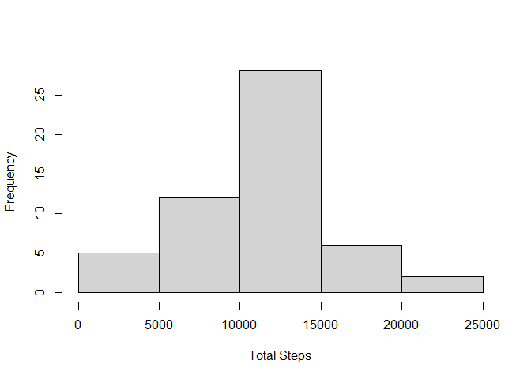
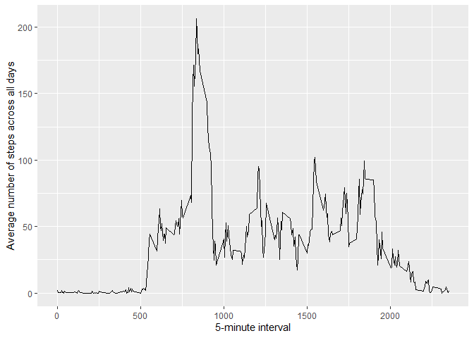
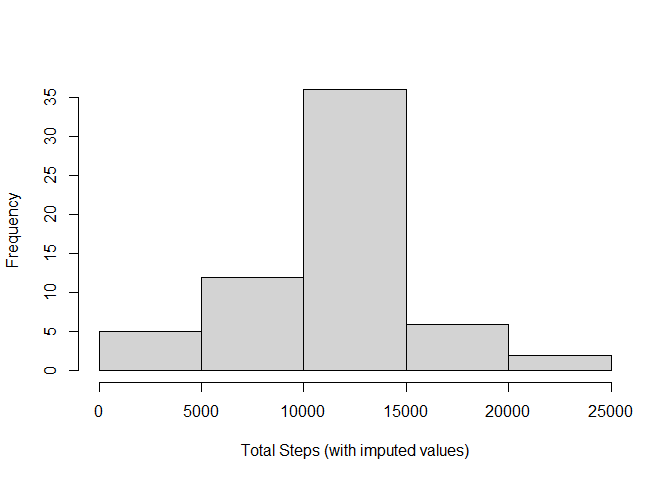
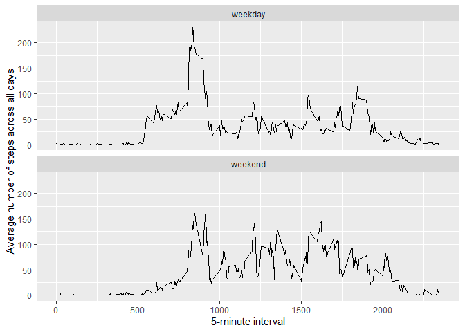

```r
# use captioner to add figure number and caption
library(captioner)
fig_nums <- captioner()
fig_nums("figa", "A histogram of the total number of steps taken each day")
```

```
## [1] "Figure  1: A histogram of the total number of steps taken each day"
```

```r
fig_nums("figb", "A time series plot of the 5-minute interval and the average number of steps taken, averaged across all days")
```

```
## [1] "Figure  2: A time series plot of the 5-minute interval and the average number of steps taken, averaged across all days"
```

```r
fig_nums("figd", "A histogram of the total number of steps taken each day, with missing data replaced with the mean for that 5-minute interval")
```

```
## [1] "Figure  3: A histogram of the total number of steps taken each day, with missing data replaced with the mean for that 5-minute interval"
```

```r
fig_nums("figc", "A panel plot containing a time series plot of the 5-minute interval and the average number of steps taken, averaged across all weekday days or weekend days")
```

```
## [1] "Figure  4: A panel plot containing a time series plot of the 5-minute interval and the average number of steps taken, averaged across all weekday days or weekend days"
```

## Loading and preprocessing the data

```r
# locate and download the dataset
fileurl <-  "https://d396qusza40orc.cloudfront.net/repdata%2Fdata%2Factivity.zip"
download.file(fileurl, destfile = "activity.zip")
unzip("activity.zip")
# read the data
activity <- read.csv("activity.csv")
```

## What is mean total number of steps taken per day?

1.  Make a histogram of the total number of steps taken each day (ignoring the missing values)


```r
# group by 'date' and sum 'steps' using dplyr
library(dplyr)
```

```
## 
## Attaching package: 'dplyr'
```

```
## The following objects are masked from 'package:stats':
## 
##     filter, lag
```

```
## The following objects are masked from 'package:base':
## 
##     intersect, setdiff, setequal, union
```

```r
stepsum <- activity %>% group_by(date) %>% summarise(sum_steps=sum(steps))
hist(stepsum$sum_steps, main = "", xlab = "Total Steps")
```

<div class="figure" style="text-align: center">

<p class="caption">Figure  1: A histogram of the total number of steps taken each day</p>
</div>

2.  Calculate and report the **mean** and **median** total number of steps

    The **mean** total number of steps is 10766.19 with NA values stripped
    
    The **median** total number of steps is 10765

## What is the average daily activity pattern?

1.  Make a time series plot (i.e. type = "l") of the 5-minute interval (x-axis) and the average number of steps taken, averaged across all days (y-axis)


```r
library(ggplot2)
# group by 'interval' and summarise by the average number of 'steps', averages across all days
ts <- activity %>% group_by(interval) %>%
    summarise(avg_steps=mean(steps, na.rm = TRUE))
ggplot(ts, aes(x=interval, y=avg_steps)) +
        geom_line() +
        xlab("5-minute interval") +
        ylab("Average number of steps across all days")
```

<div class="figure" style="text-align: center">

<p class="caption">Figure  2: A time series plot of the 5-minute interval and the average number of steps taken, averaged across all days</p>
</div>

2.  Which 5-minute interval, on average across all the days in the dataset, contains the maximum number of steps?

    The maximum number of steps is **206.17** and the 5-minute interval that corresponds to the maximum number of steps is **835**

## Imputing missing values

1.  Calculate and report the total number of missing values in the dataset (i.e. the total number of rows with NAs)

    The number of NAs in the dataset is **2304**.
    
2.  Devise a strategy for filling in all of the missing values in the dataset. The strategy does not need to be sophisticated. For example, you could use the mean/median for that day, or the mean for that 5-minute interval, etc.

    **I have already calculated the mean for each 5-minute minute interval so I will use the result to impute the missing values.**

3.  Create a new dataset that is equal to the original dataset but with the missing data filled in.


```r
# merge the mean for each 5-minute interval into the activity file and use coalesce to replace only the missing values and create a new dataset 'activity2' with the missing data filled in
activity2 <- activity %>% left_join(ts, by = "interval") %>%
        mutate(steps = coalesce(steps, avg_steps)) %>%
        select(-c(avg_steps))
```

4.  Make a histogram of the total number of steps taken each day and Calculate and report the mean and median total number of steps taken per day. Do these values differ from the estimates from the first part of the assignment? What is the impact of imputing missing data on the estimates of the total daily number of steps?


```r
stepsum2 <- activity2 %>% group_by(date) %>% summarise(sum_steps=sum(steps))

hist(stepsum2$sum_steps, main = "", xlab = "Total Steps (with imputed values)")
```

<div class="figure" style="text-align: center">

<p class="caption">Figure  3: A histogram of the total number of steps taken each day, with missing data replaced with the mean for that 5-minute interval</p>
</div>

5. Calculate and report the mean and median total number of steps.
    The mean total number of steps with imputed data is **10766.19** and the median is **10766.19**. Imputing the mean 
    preserves the mean of the observed data. The result is no change in the mean and the median has increased by 1.19 and is now equal to the mean. 

## Are there differences in activity patterns between weekdays and weekends?

1.  Create a new factor variable in the dataset with two levels -- "weekday" and "weekend" indicating whether a given date is a weekday or weekend day.


```r
activity2 <- activity2 %>% mutate(day = weekdays(as.Date(date),
                                                 abbreviate = TRUE))
activity2$day  <- ifelse(activity2$day %in% c("Sat", "Sun"),
                         "weekend", "weekday") 
 
activity2$day <- as.factor(activity2$day)
```

2.  Make a panel plot containing a time series plot (i.e. type = "l") of the 5-minute interval (x-axis) and the average number of steps taken, averaged across all weekday days or weekend days (y-axis).


```r
# group by 'interval' and 'day' and summarise by the average number of 'steps', averages across all days
ts2 <- activity2 %>% group_by(interval, day) %>% summarise(avg_steps=mean(steps))
```

```
## `summarise()` has grouped output by 'interval'. You can override using the
## `.groups` argument.
```

```r
# plot the result in ggplot
ggplot(ts2, aes(x=interval, y=avg_steps)) +
        geom_line() +
        facet_wrap(. ~ day, ncol = 1) +
        xlab("5-minute interval") +
        ylab("Average number of steps across all days")
```

<div class="figure" style="text-align: center">

<p class="caption">Figure  4: A panel plot containing a time series plot of the 5-minute interval and the average number of steps taken, averaged across all weekday days or weekend days</p>
</div>
## Assignment complete
